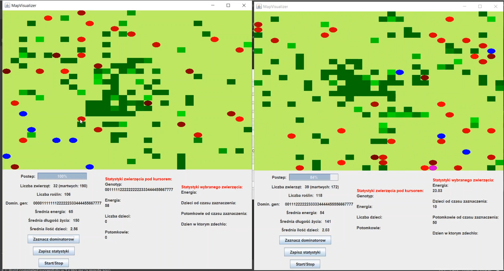
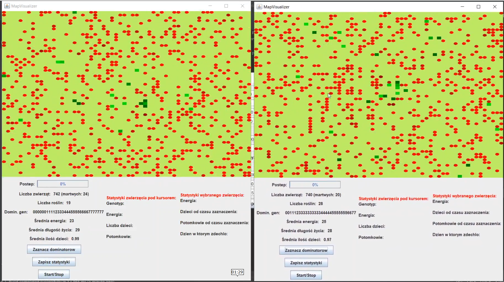

# Generator ewolucyjny
[Project topic](./media/topic.md)

## Demo
[YouTube](https://www.youtube.com/watch?v=KZPzAEUmVhA)




## Import
Import as maven project:
File -> Open -> *search folder* -> select pom.xml -> 'open as project'  
In case of maven asks you to enable auto-import modules -> select *yes*  
Wait for the end of the import and run program.  

Or use .jar version  
[click](https://github.com/rivit98/evolution_java/releases)
```
java -jar ./jar_file.jar [startAnimals] [path to json]
```


